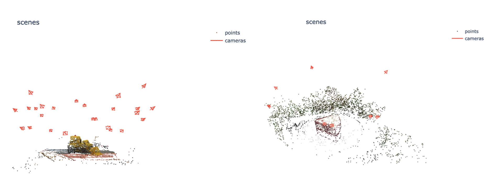

# VGGSfM: Visual Geometry Grounded Deep Structure From Motion


**[Meta AI Research, GenAI](https://ai.facebook.com/research/)**; **[University of Oxford, VGG](https://www.robots.ox.ac.uk/~vgg/)**


[Jianyuan Wang](https://jytime.github.io/), [Nikita Karaev](https://nikitakaraevv.github.io/), [Christian Rupprecht](https://chrirupp.github.io/), [David Novotny](https://d-novotny.github.io/)


<p 
dir="auto">[<a href="https://arxiv.org/pdf/2312.04563.pdf" rel="nofollow">Paper</a>]
[<a href="https://vggsfm.github.io/" rel="nofollow">Project Page</a>] 
[Version 2.0]
</p> 


**Updates:**
- [Jun 25, 2024] Upgrade to VGGSfM 2.0! More memory efficient, more robust, more powerful, and easier to start!


- [Apr 23, 2024] Release the code and model weight for VGGSfM v1.1.


## Installation
We provide a simple installation script that, by default, sets up a conda environment with Python 3.10, PyTorch 2.1, and CUDA 12.1.

```.bash
source install.sh
```

This script installs official pytorch3d, accelerate, lightglue, pycolmap, and visdom. Besides, it will also (optionally) install [poselib](https://github.com/PoseLib/PoseLib) using the python wheel under the folder ```wheels```, which is compiled by us instead of the official poselib team. 

## Demo 

### 1. Download Model
To get started, you need to first download the checkpoint. We provide the checkpoint for v2.0 model by [Hugging Face](https://huggingface.co/facebook/VGGSfM/blob/main/vggsfm_v2_0_0.bin) and [Google Drive](https://drive.google.com/file/d/163bHiqeTJhQ2_UnihRNPRA4Y9X8-gZ1-/view?usp=sharing).

### 2. Run the Demo 

Now time to enjoy your 3D reconstruction! You can start by our provided examples, such as:

```bash
python demo.py SCENE_DIR=examples/cake resume_ckpt=/PATH/YOUR/CKPT 

python demo.py SCENE_DIR=examples/british_museum query_frame_num=2 resume_ckpt=/PATH/YOUR/CKPT 

python demo.py SCENE_DIR=examples/apple query_frame_num=5 max_query_pts=2048 resume_ckpt=/PATH/YOUR/CKPT 
```

All the flags are defaulted in ```cfgs/demo.yaml```. 

The reconstruction result (camera parameters and 3D points) will be automatically saved in the COLMAP format at ```output/seq_name```. You can use the [COLMAP GUI](https://colmap.github.io/gui.html) to view them. 

If you want to visualize it more easily, we provide an approach supported by [visdom](https://github.com/fossasia/visdom). To begin using Visdom, start the server by entering ```visdom``` in the command line. Once the server is running, access Visdom by navigating to ```http://localhost:8097``` in your web browser. Now every reconstruction will be visualized and saved to the visdom server by enabling ```visualize=True```:

```bash
python demo.py visualize=True ...(other flags)
```

By doing so, you should see an interface such as:




### 3. Try your own data

You only need to specify the address of your data, such as:

```bash
python demo.py SCENE_DIR=examples/YOUR_FOLDER ...(other flags)
```

Please ensure that the images are stored in ```YOUR_FOLDER/images```. This folder should contain only the images. Check the ```examples``` folder for the desired data structure.


Have fun and feel free to create an issue if you meet any problem. SfM is always about corner/hard cases. I am happy to help. If you prefer not to share your images publicly, please send them to me by email.


## Testing 

We are still preparing the testing script for VGGSfM v2. However, you can use our code for VGGSfM v1.1 to reproduce our benchmark results in the paper. Please refer to the branch ```v1.1```.


## Acknowledgement

We are highly inspired by [colmap](https://github.com/colmap/colmap), [pycolmap](https://github.com/colmap/pycolmap), [posediffusion](https://github.com/facebookresearch/PoseDiffusion), [cotracker](https://github.com/facebookresearch/co-tracker), and [kornia](https://github.com/kornia/kornia).


## License
See the [LICENSE](./LICENSE) file for details about the license under which this code is made available.


## Citing VGGSfM

If you find our repository useful, please consider giving it a star ⭐ and citing our paper in your work:

```bibtex
@article{wang2023vggsfm,
  title={VGGSfM: Visual Geometry Grounded Deep Structure From Motion},
  author={Wang, Jianyuan and Karaev, Nikita and Rupprecht, Christian and Novotny, David},
  journal={arXiv preprint arXiv:2312.04563},
  year={2023}
}
